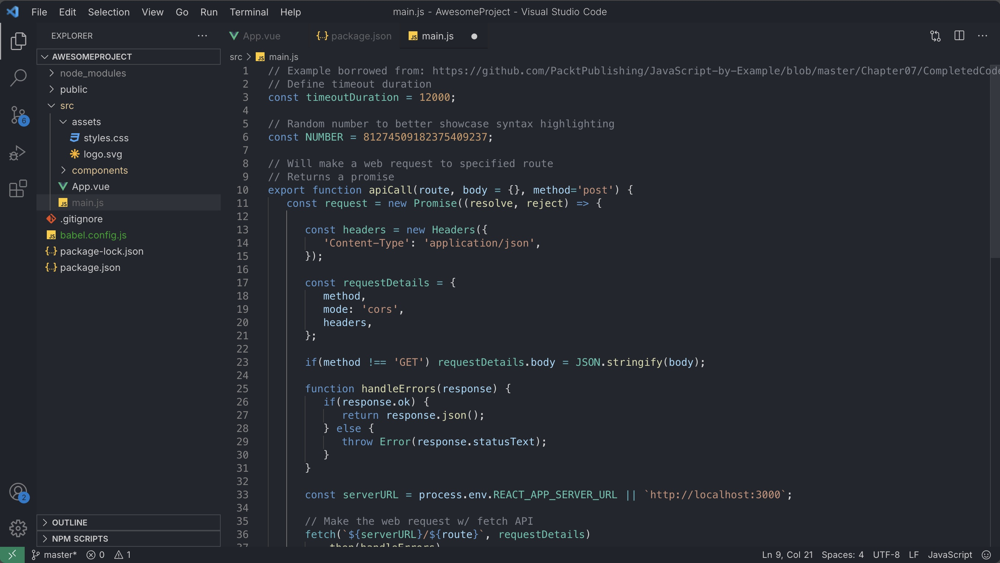
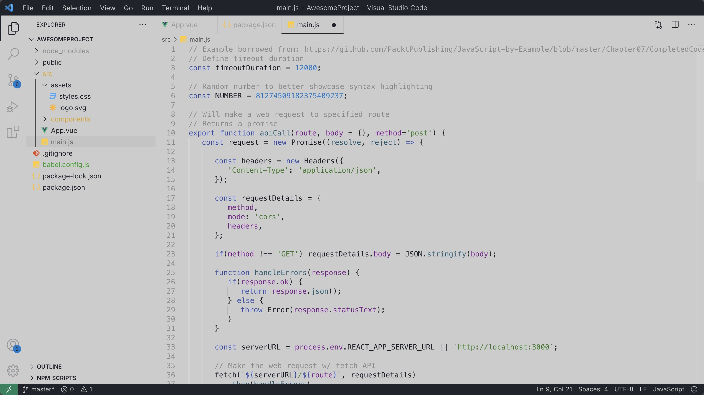

# 🖤 The Best VSCode Theme Ever

Minimal. Elegant. Focused.

Welcome to **The Best VSCode Theme Ever**, sleek, minimal, and distraction-free Visual Studio Code theme designed for developers who want a clean, focused coding experience. Whether you're working late at night or under bright lights, **The Best VSCode Theme Ever** balances aesthetics and practicality — with carefully tuned colors to reduce eye strain and improve code readability.

---

## 🌌 Preview

<!-- Add more screenshots as needed -->

---

## 🚀 Installation

1. Launch **Visual Studio Code**.
2. Go to the Extensions sidebar: `View → Extensions` (or press `Ctrl+Shift+X`).
3. Search for `The Best VSCode Theme Ever` or install directly from [this link](https://marketplace.visualstudio.com/items?itemName=danielvfrodrigues.bestvscodetheme).
4. Click **Install**.
5. Open the Command Palette (`Ctrl+Shift+P`), search for `Color Theme`, and choose **Best VSCode Theme**.

---

## 🎨 Why You’ll Love It

- ⚫ Beautiful not-so-dark background with cozy syntax colors
- ⚪️ Minimalist not-so-white background vibrant syntax colors
- ✨ Designed for optimal readability and low eye strain
- 🔍 Supports a wide range of languages and file types
- ⚙️ Built with performance and simplicity in mind